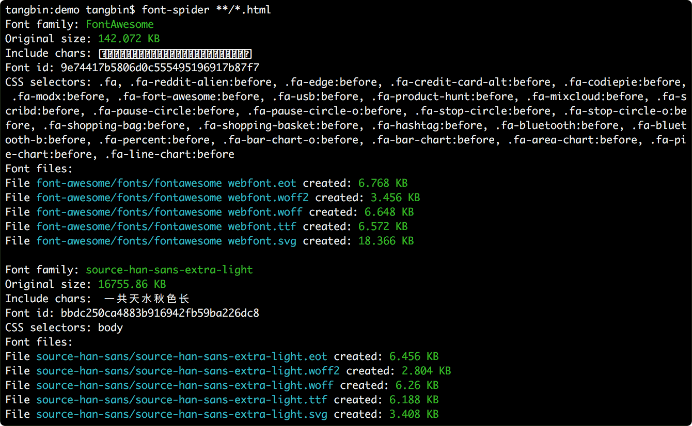

**字蛛是一个智能 WebFont 压缩工具，它能自动分析出页面使用的 WebFont 并进行按需压缩。**

## 使用经历
我想给我的网站换换字体，但是我看到网上有很多精美的开源字体，但是字体大小通常都高达20多兆 (20MB+)，这真的让我很难忍受，要知道我这个网站在中国国内访问浏览器的平均下载速度大概是三兆每秒。也就是说，要至少八秒钟才能加载出来这个精美的字体，这反而不能给我们的观众小老爷老爷们带来一个良好的体验，发挥让人更加心烦气躁。我就开始想我可不愿意就此而妥协，我不停的在网上寻找各种可以用来压缩字体文件大小的工具，最后找到了这一款运行NodeJS的Font Spider，他真的对静态网站的字体优化做出了极大的贡献，把本来20多兆大小的字体文件压缩到了只有700K ！

## 使用方法

### 安装

首先你得安装[NodeJS](http://nodejs.org) 但我相信我的观众们作为一个开发网站的资深编程大师肯定都早已安装这里我就不再叙述～需要的自行到这个网站下载安装包吧
然后我们在命令提示符里面运行以下内容就可以顺利安装。

``` shell
npm install font-spider -g
```

当然如果你现在中国国内因为很有可能被封，你可以考虑使用NPM的镜像源，我这里最推荐NPM Mirror，只要配置 registry 即可

``` shell
npm config set registry https://registry.npmmirror.com
```

### 了解特性和限制
1. 压缩字体：智能删除没有被使用的字形数据，大幅度减少字体体积
2. 生成字体：支持 woff2、woff、eot、svg 字体格式生成；支持图标字体
3. 不支持 javascript 动态插入的元素与样式
4. **.otf 字体需要转换成 .ttf 格式才能被压缩**
5. 仅支持 `utf-8` 编码的 HTML 与 CSS 文件
6. CSS `content` 仅支持 `content: 'prefix'` 和 `content: attr(value)` 这两种形式
### 使用前准备
首先你需要书写字体CSS在使用HTML引用，这里可以直接用我写好的更加方便：

``` css
@font-face {
    font-family: 'FONT';
    src:
        url('../font/source.eot?#font-spider') format('embedded-opentype'),
        url('../font/source.woff2') format('woff2'),
        url('../font/source.woff') format('woff'),
        url('../font/source.ttf') format('truetype'),
        url('../font/source.svg') format('svg');
    font-weight: 1000;
    font-style: normal;
    font-display: swap;
}

.font {
    font-family: "FONT";
    font-size: 2rem;
}
```

``` html
<!DOCTYPE html>
<html lang="en">

<head>
    <meta charset="UTF-8">
    <meta name="viewport" content="width=device-width, initial-scale=1.0">
    <title>NODE-JS FONT SPIDER</title>
    <link rel="stylesheet" href="./fonts/fontscc.css">
</head>
<body>
    <div class="font">
        这里填写你需要的压缩的字体文字 (HELLO WORLD!!!)
    </div>
</body>
</html>
```

### 压缩 WebFont
最后我们就可以开开心心的压缩字体啦，这里甚至一个或多个页面地址，支持 http 形式，使用以下命令行：


``` shell
font-spider [options] <htmlFile1 htmlFile2 ...>
font-spider index.html
font-spider dest/news.html dest/index.html dest/about.html
```

### 进阶用法：Options

```
-h, --help                    输出帮助信息
-V, --version                 输出当前版本号
--info                        输出 WebFont 的 JSON 描述信息，不压缩与转码
--ignore <pattern>            忽略的文件配置（支持正则表达式）
--map <remotePath,localPath>  映射 CSS 内部 HTTP 路径到本地（支持正则表达式）
--no-backup                   关闭字体备份功能
--debug                       调试模式，打开它可以显示 CSS 解析错误
```
---

使用通配符压缩多个 HTML 文件关联的 WebFont：

``` shell
font-spider dest/*.html
```

`--info` 查看网站所应用的 WebFont：

``` shell
font-spider --info http://fontawesome.io
```

`--ignore` 忽略文件：

``` shell
font-spider --ignore "icon\\.css$" dest/*.html
```

`--map` 参数将线上的页面的 WebFont 映射到本地来进行压缩（本地路径必须使用绝对路径）：

``` shell
font-spider --map "http://font-spider.org/font,/Website/font" http://font-spider.org/index.html
```

### OTF文件转TTF
还有些观众老爷们，可能不知道怎么用OTF文件转TTF文件，这里是Github上的一个Python Package，绝对奏效：[OTF2TTF](https://github.com/awesometoolbox/otf2ttf/tree/master)
使用方法：

``` shell
pip install otf2ttf
otf2ttf MyFont.ttf
```

这下面是那位大神的源代码otf2ttf.py:

``` python
#!/usr/bin/env python3

import argparse
import logging
import os
import sys

from fontTools.pens.cu2quPen import Cu2QuPen
from fontTools import configLogger
from fontTools.misc.cliTools import makeOutputFileName
from fontTools.pens.ttGlyphPen import TTGlyphPen
from fontTools.ttLib import TTFont, newTable


log = logging.getLogger()

# default approximation error, measured in UPEM
MAX_ERR = 1.0

# default 'post' table format
POST_FORMAT = 2.0

# assuming the input contours' direction is correctly set (counter-clockwise),
# we just flip it to clockwise
REVERSE_DIRECTION = True


def glyphs_to_quadratic(glyphs, max_err=MAX_ERR, reverse_direction=REVERSE_DIRECTION):
    quadGlyphs = {}
    for gname in glyphs.keys():
        glyph = glyphs[gname]
        ttPen = TTGlyphPen(glyphs)
        cu2quPen = Cu2QuPen(ttPen, max_err, reverse_direction=reverse_direction)
        glyph.draw(cu2quPen)
        quadGlyphs[gname] = ttPen.glyph()
    return quadGlyphs


def update_hmtx(ttFont, glyf):
    hmtx = ttFont["hmtx"]
    for glyphName, glyph in glyf.glyphs.items():
        if hasattr(glyph, "xMin"):
            hmtx[glyphName] = (hmtx[glyphName][0], glyph.xMin)


def otf_to_ttf(ttFont, post_format=POST_FORMAT, **kwargs):
    assert ttFont.sfntVersion == "OTTO"
    assert "CFF " in ttFont

    glyphOrder = ttFont.getGlyphOrder()

    ttFont["loca"] = newTable("loca")
    ttFont["glyf"] = glyf = newTable("glyf")
    glyf.glyphOrder = glyphOrder
    glyf.glyphs = glyphs_to_quadratic(ttFont.getGlyphSet(), **kwargs)
    del ttFont["CFF "]
    glyf.compile(ttFont)
    update_hmtx(ttFont, glyf)

    ttFont["maxp"] = maxp = newTable("maxp")
    maxp.tableVersion = 0x00010000
    maxp.maxZones = 1
    maxp.maxTwilightPoints = 0
    maxp.maxStorage = 0
    maxp.maxFunctionDefs = 0
    maxp.maxInstructionDefs = 0
    maxp.maxStackElements = 0
    maxp.maxSizeOfInstructions = 0
    maxp.maxComponentElements = max(
        len(g.components if hasattr(g, "components") else [])
        for g in glyf.glyphs.values()
    )
    maxp.compile(ttFont)

    post = ttFont["post"]
    post.formatType = post_format
    post.extraNames = []
    post.mapping = {}
    post.glyphOrder = glyphOrder
    try:
        post.compile(ttFont)
    except OverflowError:
        post.formatType = 3
        log.warning("Dropping glyph names, they do not fit in 'post' table.")

    ttFont.sfntVersion = "\000\001\000\000"


def main(args=None):
    configLogger(logger=log)

    parser = argparse.ArgumentParser()
    parser.add_argument("input", nargs="+", metavar="INPUT")
    parser.add_argument("-o", "--output")
    parser.add_argument("-e", "--max-error", type=float, default=MAX_ERR)
    parser.add_argument("--post-format", type=float, default=POST_FORMAT)
    parser.add_argument(
        "--keep-direction", dest="reverse_direction", action="store_false"
    )
    parser.add_argument("--face-index", type=int, default=0)
    parser.add_argument("--overwrite", action="store_true")
    options = parser.parse_args(args)

    if options.output and len(options.input) > 1:
        if not os.path.isdir(options.output):
            parser.error(
                "-o/--output option must be a directory when "
                "processing multiple fonts"
            )

    for path in options.input:
        if options.output and not os.path.isdir(options.output):
            output = options.output
        else:
            output = makeOutputFileName(
                path,
                outputDir=options.output,
                extension=".ttf",
                overWrite=options.overwrite,
            )

        font = TTFont(path, fontNumber=options.face_index)
        otf_to_ttf(
            font,
            post_format=options.post_format,
            max_err=options.max_error,
            reverse_direction=options.reverse_direction,
        )
        font.save(output)


if __name__ == "__main__":
    sys.exit(main())
```

## 相关链接
- [字蛛文档翻译计划：征集日文、韩文翻译志愿者](https://github.com/aui/font-spider/issues/71)
- [字蛛开发计划](https://github.com/aui/font-spider/issues/2)
- [字蛛更新日志](https://github.com/aui/font-spider/blob/master/CHANGELOG.md)
- [字蛛接口文档](https://github.com/aui/font-spider/blob/master/API.md)
- [字蛛 grunt 版本](https://github.com/aui/grunt-font-spider)
- [字蛛 gulp 版本](https://github.com/aui/gulp-font-spider)
- [Google: 网页字体优化](https://developers.google.com/web/fundamentals/performance/optimizing-content-efficiency/webfont-optimization?hl=zh-cn)
- [Baidu: fontmin](https://github.com/ecomfe/fontmin)
